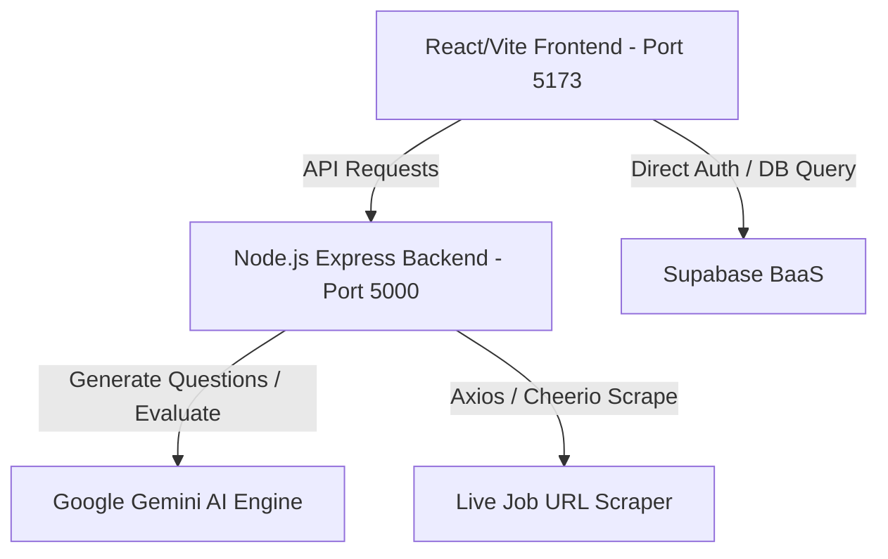

# Tài Liệu Kiến Trúc Hệ Thống (ARCHITECTURE.md)

Tài liệu này mô tả chi tiết kiến trúc hệ thống, cấu trúc thư mục, các cổng kết nối và luồng dữ liệu của phiên bản MVP hệ thống phỏng vấn giả lập **X-Interview**.

---

## 1. Tổng Quan Kiến Trúc (Architectural Overview)

Hệ thống **X-Interview** sử dụng mô hình Client-Server phân tách với kết nối dịch vụ Backend-as-a-Service (BaaS) từ Supabase:



### Thành phần công nghệ:
1.  **Frontend (Giao diện):** React SPA dựng trên nền **Vite** để đảm bảo tốc độ tải và đóng gói nhanh nhất.
    *   **Styling:** Kết hợp **Tailwind CSS** cho các màn hình trải nghiệm cao cấp (Login, Register, Dashboard, Chat room) và **Cloudscape Design System** cho các giao diện quản trị doanh nghiệp.
2.  **Backend (API Server):** Node.js với framework **Express** để xử lý các nghiệp vụ nâng cao (cào dữ liệu trực tuyến, điều phối hội đồng phỏng vấn AI, stream dữ liệu).
3.  **Database & Auth (Dữ liệu & Xác thực):** **Supabase** (PostgreSQL) cung cấp cơ chế lưu trữ tài khoản, bảo mật Row Level Security (RLS) và lưu trữ file CV ứng viên (Supabase Storage).
4.  **AI Engine (Trình xử lý trí tuệ nhân tạo):** SDK Google Generative AI kết hợp mô hình **Gemini 1.5 Flash** để phân tích CV, JD và chấm điểm câu trả lời của ứng viên.

---

## 2. Cấu Trúc Thư Mục Thực Tế (Directory Structure)

Dự án được tổ chức dưới dạng cấu trúc dự án kép (Frontend & Backend song song):

```
App_Phong_Van/
├── .agent/                      # Quản lý ngữ cảnh AI (Rules, Skills, Workflows)
├── docs/                        # Tài liệu đặc tả kỹ thuật chi tiết
│   ├── ARCHITECTURE.md          # Kiến trúc và luồng xử lý
│   ├── DATABASE_SCHEMA.md       # Sơ đồ ERD, bảng dữ liệu và chính sách RLS
│   ├── UI_COMPONENTS.md         # Mô tả thiết kế giao diện & luồng UI
│   └── AI_INTEGRATION.md        # Tích hợp AI Engine & Thuật toán cào tin
├── supabase/
│   └── schema.sql               # File SQL cấu trúc DB, RLS và triggers
├── backend/                     # API Server bằng Express (Cổng 5000)
│   ├── server.js                # Toàn bộ mã nguồn API định tuyến, logic AI & Scraper
│   └── package.json             # Khai báo thư viện (cheerio, axios, google-genai)
└── frontend/                    # Giao diện React/Vite (Cổng 5173)
    ├── package.json             # Khai báo thư viện (React, Tailwind CSS, Cloudscape)
    ├── vite.config.js           # Cấu hình đóng gói Vite
    ├── tailwind.config.js       # Cấu hình theme màu sắc X-Interview
    └── src/
        ├── App.jsx              # Routing & Sidebar Navigation
        ├── main.jsx             # Điểm khởi chạy React App
        ├── index.css            # Khai báo Tailwind CSS & Style bổ sung
        └── components/          # Thư mục lưu trữ các component giao diện
            ├── Auth.jsx         # Màn hình Đăng ký / Đăng nhập (Tailwind CSS)
            ├── HomeDashboard.jsx # Dashboard Ứng viên (Tailwind CSS)
            ├── StartInterview.jsx # Setup Wizard chuẩn bị phỏng vấn
            ├── InterviewRoom.jsx # Phòng chat thi phỏng vấn trực tiếp
            ├── JobsDashboard.jsx # Bảng danh sách việc làm & cào JD
            ├── CVProfile.jsx    # Quản lý CV Vault của ứng viên
            ├── Pricing.jsx      # Xem bảng giá nâng cấp Premium
            ├── Blog.jsx         # Blog chia sẻ kinh nghiệm phỏng vấn
            └── InterviewerDashboard.jsx # Dashboard Nhà tuyển dụng (Cloudscape)
```

---

## 3. Phân Bổ Cổng Kết Nối & Môi Trường (Ports & Environments)

*   **Vite Dev Frontend:** Chạy tại địa chỉ `http://localhost:5173`
*   **Express Backend Server:** Chạy tại địa chỉ `http://localhost:5000`
*   **Chế độ Offline Fallback:** Nếu backend phát hiện không có cấu hình Supabase thật trong `.env`, hệ thống sẽ khởi tạo lớp dữ liệu giả lập (Mock DB) lưu trữ trực tiếp trên RAM của server Node.js. Điều này giúp dự án luôn sẵn sàng chạy thử nghiệm cục bộ không cần mạng.

---

## 4. Luồng Xử Lý Dữ Liệu Chính (Data Flow Pipelines)

### Luồng 1: Khởi tạo phiên phỏng vấn từ mô tả công việc (JD)
1.  Người dùng dán link tuyển dụng vào ô cào tin hoặc viết JD thủ công -> Gọi `/api/crawl-jd`.
2.  Backend tải nội dung website, bóc tách text thô -> Gửi Gemini AI phân tích kỹ năng và trả về JSON có cấu trúc.
3.  Người dùng xác nhận -> Khởi tạo bộ câu hỏi thi phỏng vấn thông qua Gemini AI -> Lưu vào bảng `question_banks`.
4.  Khởi tạo phiên phỏng vấn mới trong `interview_sessions` với trạng thái `ongoing` và `recruiter_joined = false`.

### Luồng 2: Nhận câu trả lời và Đánh giá (Interview QA & Scoring)
1.  Ứng viên nhập câu trả lời và nhấn "Gửi" -> Gọi `/api/sessions/answer`.
2.  Backend kiểm tra và lấy lịch sử hội thoại đầy đủ của session từ DB.
3.  Gửi lịch sử chat, nội dung câu trả lời và câu hỏi lên Gemini AI để chấm điểm (1-10) và viết nhận xét chi tiết.
4.  Gemini AI trả về điểm số và câu hỏi tiếp theo dựa trên vai trò xoay vòng (Tech Lead -> HR -> PM).
5.  Dữ liệu được cập nhật lại vào `chat_history` của session trong database.
