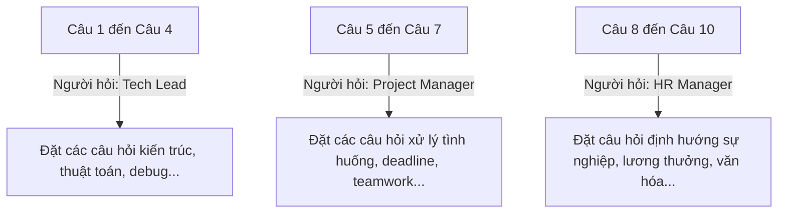

# Tài Liệu Tích Hợp AI Engine & Cào Dữ Liệu (AI_INTEGRATION.md)

Tài liệu này đặc tả các Prompt hệ thống, thuật toán cào thông tin JD thông minh và cơ chế chấm điểm thời gian thực của trí tuệ nhân tạo (Gemini AI) trong dự án **X-Interview**.

---

## 1. Tính Năng Cào Link Tuyển Dụng Thông Minh (Smart Scraping API)

Khi nhà tuyển dụng hoặc ứng viên dán một đường link tuyển dụng thực tế (ví dụ: TopCV, LinkedIn), hệ thống sẽ kích hoạt endpoint `/api/crawl-jd`:

### 1.1. Quy trình cào thông tin
1.  **Axios Fetch:** Backend gửi request tải mã nguồn HTML thô của URL.
2.  **Cheerio Parsing:** Loại bỏ toàn bộ các thẻ `<script>`, `<style>`, `<nav>`, `<footer>` và trích xuất chuỗi văn bản thô nằm trong thẻ `<body>`.
3.  **AI Extraction:** Chuỗi văn bản thô được gửi qua Gemini AI kèm theo Prompt hệ thống để bóc tách dữ liệu có cấu trúc.

### 1.2. Prompt hệ thống phân tích JD
```
Hãy phân tích nội dung tuyển dụng dưới đây và trích xuất ra thông tin có cấu trúc dưới định dạng JSON.
Chỉ trả về JSON hợp lệ, không chứa mã markdown hoặc văn bản giải thích ngoài lề.

Cấu trúc JSON mong muốn:
{
  "company_name": "Tên công ty tuyển dụng",
  "job_title": "Tiêu đề công việc (ví dụ: Frontend Developer, Node.js Engineer...)",
  "level": "Cấp độ yêu cầu: ez (Intern/Fresher), medium (Junior/Mid), hard (Senior/Lead)",
  "requirements": ["Kỹ năng 1", "Kỹ năng 2", "Kỹ năng 3", ...]
}

Nội dung văn bản tuyển dụng thô:
[MÃ NGUỒN CHỮ THÔ ĐÃ LỌC]
```

---

## 2. API Phòng Phỏng Vấn AI & Chấm Điểm (/api/interview/chat)

Khi ứng viên trả lời từng câu hỏi trong phòng thi, câu trả lời sẽ được gửi lên `/api/interview/chat` để chấm điểm và sinh câu hỏi tiếp theo.

### 2.1. Cấu trúc Prompt Đánh Giá & Chấm Điểm
```
Bạn là một Hội đồng phỏng vấn gồm 3 thành viên:
1. Tech Lead (Chuyên môn lập trình sâu, kiểm tra thuật toán và kiến thức cứng)
2. HR Manager (Kiểm tra thái độ, cách ứng xử và sự hòa nhập văn hóa công ty)
3. Project Manager (Kiểm tra cách giải quyết vấn đề thực tế, làm việc nhóm)

Nhiệm vụ của bạn là đánh giá câu trả lời của ứng viên cho câu hỏi hiện tại:
Câu hỏi: "[CÂU HỎI HIỆN TẠI]"
Câu trả lời của ứng viên: "[CÂU TRẢ LỜI CỦA ỨNG VIÊN]"

Quy tắc chấm điểm và phản hồi:
1. Chấm điểm kỹ thuật (techScore), điểm giao tiếp (commScore), điểm tự tin (confScore) trên thang điểm 10.
2. Viết nhận xét chi tiết (feedback) chỉ rõ ưu điểm và nhược điểm trong câu trả lời.
3. Nếu ứng viên nói chuyện phiếm ngoài lề hoặc trả lời hoàn toàn lạc đề, hãy đặt cả 3 điểm số bằng 0 và lịch sự nhắc nhở quay lại chủ đề phỏng vấn (Anti-derailment).
4. Xác định thành viên tiếp theo của hội đồng phỏng vấn đặt câu hỏi dựa trên chỉ số câu hỏi hiện tại.
5. Đưa ra câu hỏi tiếp theo (nextQuestion) phù hợp với chủ đề và vai trò của người phỏng vấn mới.
6. Cung cấp một câu trả lời mẫu tối ưu (sampleAnswer) để ứng viên tham khảo.

Định dạng trả về bắt buộc dưới dạng JSON:
{
  "scores": {
    "techScore": 8,
    "commScore": 9,
    "confScore": 8
  },
  "feedback": "Nhận xét chi tiết của bạn...",
  "sampleAnswer": "Câu trả lời mẫu tham khảo tối ưu...",
  "nextQuestion": "Câu hỏi tiếp theo từ [Vai trò mới]: ...",
  "nextInterviewerRole": "Tech Lead" | "HR" | "PM"
}
```

---

## 3. Thuật Toán Xoay Vòng Vai Trò (Rotational AI Interviewers)

Để tạo cảm giác chân thực như một buổi hội đồng phỏng vấn thực tế, hệ thống tự động xoay vòng vai trò người đặt câu hỏi dựa trên chỉ số câu hỏi hiện tại (`current_question_index` từ 0 đến 9):



Cơ chế này được lập trình cứng trong backend để Gemini AI luôn phát sinh câu hỏi và xưng hô đúng vai trò của từng thành viên hội đồng phỏng vấn.

---

## 4. Cơ Chế Khóa Phòng Chờ Đồng Bộ (Gated Timer Sync)

Để ngăn ứng viên xem trước đề thi khi chưa có sự hiện diện giám sát của Nhà tuyển dụng:
*   Mặc định khi bắt đầu phòng thi, `recruiter_joined` được gán bằng `false`.
*   Candidate Client gửi yêu cầu polling `GET /api/sessions/status/:id` liên tục mỗi 1.5 giây.
*   Khi Recruiter nhấn nút **"Tham gia"** từ dashboard tuyển dụng, Backend kích hoạt `recruiter_joined = true`.
*   Tín hiệu polling trả về `recruiterJoined: true` lập tức gỡ bỏ màn hình khóa, kích hoạt đồng hồ đếm ngược 30 phút và bắt đầu buổi phỏng vấn.
